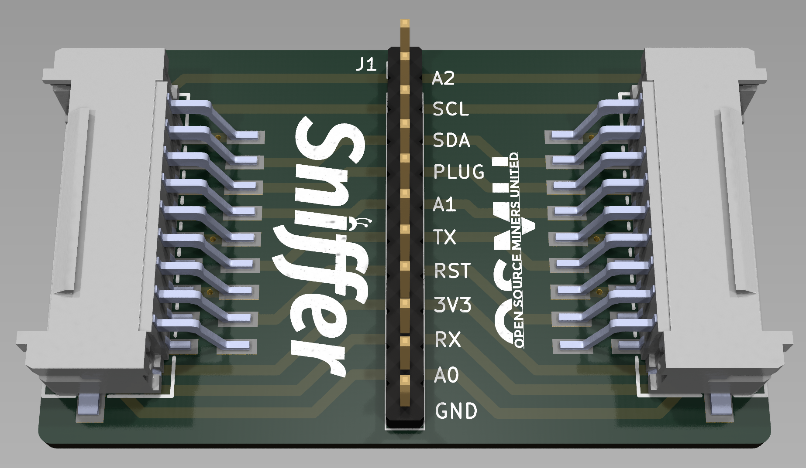

# AntSniffer
This device is used to tap into the signals on an Antminer data cable for logic analyzers and other development purposes.
The base design is a 4 layer PCB, with 2 SMD connectors that are compatible with Antminer 18 pin data cables. 
These cables are used for plugging in the hashboard to the control board. Also featured is an LED used to indicate 
that the connection is good and you are getting the required 3.3 volts from the control board.
All data connections are broken out into a pin header with labels for their functions.

For other cool stuff like this join my Discord! There we discuss, design, and develop open source mining solutions and a little of everything else too!
https://discord.gg/Px8RAvb9nr
